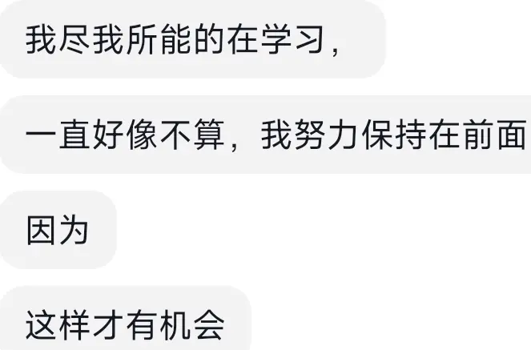

# 同桌的她

六年级时，我转到了这个九年制的私立学校，她已经在这里读书两年了。

因为是乡镇学校，即使我的平均分数只有70多，也依然能排到一个中等偏下的名次，而她，名列前茅，是老师眼中的好苗子。

早恋在我们这种住宿学校不是新鲜事，大眼睛长头发，肤白貌美，文质彬彬，她在五年级时便有了对象，一个帅气的男孩。

男孩的成绩也很好，她俩的关系也早就得到了老师和父母们的默许，是所有人眼中的青梅竹马天生一对。

她很文静，但是男孩很活泼，课余时间男孩经常找她嬉戏打闹，如果遇到她在认真做题，男孩就回到自己的位置上不再打扰。

他们本该凭借杰出的成绩，一起踏进我们县城最好的高中，继续这段佳话。

世事无常，生活不是小说。

因为是九年制学校，在升初一时我们班级来了许多新面孔。

男生宿舍也多了一些新的味道。

各种味道的电子烟开始流行。

各种纸牌游戏开始风靡。

各种酒水，各种手机...

男孩很活泼，这些热闹流行的事物逃不开男孩的吸引力。

他开始带手机。

他学会了抽烟。

他学会了翻墙。

他开始晚上溜出宿舍。

他成绩一落千丈。

当初一第一学期结束时，女孩以全年级第一的成绩拿到了最高奖学金。

当初一第一学期结束时，男孩以人格魅力和朋友们打成一片。

青春期时的男生脑子里难免有些废料，男孩在宿舍也会提到女孩，和他的朋友们。

好像男孩也意识到了什么，在一天中午，大家都在洗衣服时，男孩无意般地问我，

“你说，我和她能走到最后吗”

十三四岁的孩子们总会去预料未来。

“如果你们最后能上同一所高中的话”，我像是一个大师，回答着。

他愣了一下，随即点点头，然后端着他的盆离开了。

她穿过他的外套，

他吃过她带的饼干，

她给他洗过衣服，

他帮过她去食堂抢面。

初二的一个晚自习，女孩哭的很厉害。

他认识了一个比她更好看，更可爱的女孩。

“我只是把她当成妹妹”。

他用这样的话安抚好了女孩。

最简单的谎言，骗过了最相信他的她。

当谎言再次被拆穿时，女孩在宿舍哭了一晚。

女孩白天像往常一样，在位置上安安静静的写着题。

男孩再也没有过来嬉戏打闹。

初三时第一次期中考试，女孩以58（满分60）的化学成绩惊艳了老师。

也惊艳了来复读的男同学。

我不知道女孩什么时候发生的转变。

在她第一次上台领取奖学金时，她是高冷的，是一身王者之气的。

但是她取得化学单科冠军时，她开心得像个小女孩。

复读的同学和她都是单亲家庭，处境相近的人总是更容易相处融洽。

晚自习时经常能看到她们在一起讨论题目。

为此班主任还把我叫到办公室询问他俩有没有早恋。

“没有的老师，她俩除了题目其他什么都不谈论”

至少在我眼中是这样的，实际也应该如此。

初三下学期时我们学校资金连断裂，宣布停办。

我们在政府的帮助下一起到了当地的公办学校，复读同学去到了另一个学校。

公办学校有实验班和普通班，因为成绩出众，有望上县城二中，我和女孩被分配到了实验班。

这本来是一件很多人求之不得的事情。

女孩却并没有开心。

她开始觉得老师讲的内容晦涩难懂。

她开始上课犯困。

她申请调回普通班（四班）。

我不喜欢实验班的压抑氛围，我去到了普通班（三班）。

相隔一道墙，我课间经常能看到她埋头苦算的身影。

中考的日子并没有在我们调动不定的节奏中推迟。

中考如期而至。

我比二中分数线高一分。

因为不喜欢县城的规规矩矩，我答应了四中老师的条件，来到了乡镇高中的实验班。

本以为再难遇到我这个同桌。

在第一次放假回家的公交车上，我看到了她。

她穿着我一样的校服，坐在我后面。

她中考发挥失常，距离三中还差20分，更别说二中了。

四中的普通班几乎没有上本科的希望。

我说，那你要不要申请调来实验班。

她全然没有了第一次领取奖学金时的气质。

时间过得很慢，或者是她回答的很慢。

她不知道。

她不知道她合不合适。

她感觉普通班也挺好的。

后来的两年，她证明了自己的话。

------------------------------

高三下学期，班主任说要调来两个普通班的女生，让我们关照一下。

普通班，女生。

会是她吗？

直到我看到独属于她的那个身影，是她！

她以连续两年班级第一的成绩被学校破格调到我们班。

她依旧可可爱爱地，收拾着自己的书桌。

我感觉，和第一次领取奖学金时的身影，并不重叠。

更像是拿到化学58分时的她。

在老师们轮番洗脑下，我们学习投入101%的精力，每个人都在为自己的目标冲刺着。

高考如期而至，我们学校本科达线率创造10年以来的历史！

三班超额完成本科达线任务！

因为是理科班，女生本科达线只有一人。

不是她。
