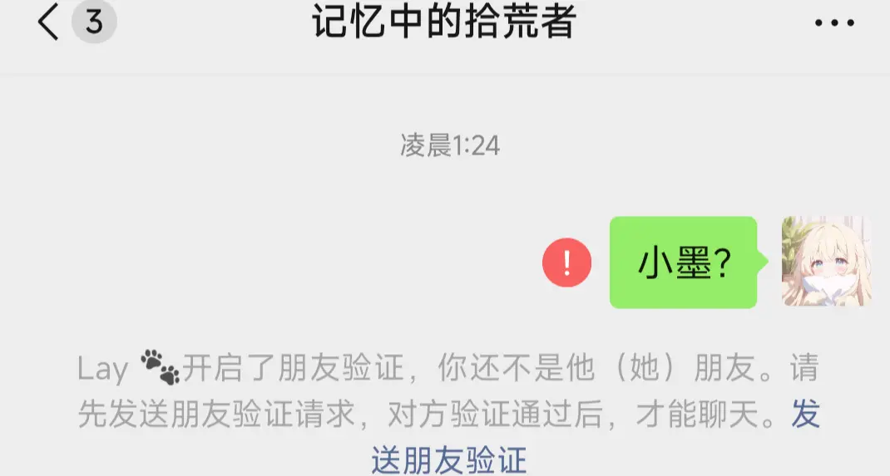

# 我不是个好姐姐

初一的时候，我转学到了隔壁县的小乡镇，和外婆住在一起。外婆总说我很瘦，要多吃一些，可是女孩子就是要瘦一些才好看啊。

       新学校是住宿学校，食堂的饭菜虽然比不上我的手艺，但就着同学间的嬉闹声，也能吃下半个馒头。或许是因为我太聪明了，虽然对于功课并没有认真，只是听听课写写作业，成绩却也轻轻松松进了年级前十，还拿到了200块钱奖学金，趁着打折，买了貂蝉的仲夏夜之梦。最好看的角色就要穿上最好看的皮肤。

       转学一年来，朋友交了不少，情书竟也收到了不少，有时候漂亮也是一种烦恼。

       初二期中考试时，学校为了防止作弊，七八年级在一个考场考试，看了考试桌贴，我的邻座应该是七年级的一个男孩子。小学弟，到时候学姐看看能不能帮帮你吧。

       直到考试前5分钟，一个满头湿漉漉的小男孩跑进考场，东张西望了一会儿才找到自己的位置——我的邻座。应该是刚洗完头还没来得及擦就来了，有意思。我从口袋里掏出一大截卫生纸，递到他手边，“擦一下，别感冒了”我笑着说道。他犹豫了一下，还是接过卫生纸，很小声地说了一句谢谢，然后又急急地跑出门去。

       等他再回来时，考试铃刚刚响起，第一场考语文，试卷早就摆好放在桌子上，他拿起笔就匆匆开始答题，没有再往其他地方看一眼。我翻了一下我的试卷，知道了这次作文没什么难度，又翻回去，开始写题。

       出师不利，第一题成语题，我把“如火如荼”的意思给忘了，多冷门的词语啊。瞥了一眼旁边的小男孩，他正在埋头苦写，先跳过吧，待会说不定就想起来了。后面的题目都很顺利，一直到我给作文画上一个句号，放下笔，看了下墙上的时钟，还剩十几分钟，我还是没能想起这个成语的意思，无聊之际，向旁边的小男孩看去。他作文差不多写到最后一段了，落笔的速度越来越慢，我看了一眼监考老师，他正往后面走去，借此机会，我能看到他的整篇作文。

       第一段字迹算不上好看，但是比较工整，越往后面写得越急，甚至有些潦草，他刚刚写完的那两句又比较工整，我心里笑了一下，现在才意识到这个问题吗，有点晚了呀。写完最后一个感叹号后，他放下了笔，眼睛却只盯着自己的作文，像一只兔子一样，不敢乱动。我看监考老师走远，小声问他，“小矮子，如火如荼是什么意思呀”。他听到我的问题后头微微向我转了一点点，语气中带着点颤，“额…本来，就是，教材改版了所以我们没学过这个词”。

       期中考试而已，有必要这么紧张嘛，有意思。

       “好吧，但还是谢谢你了”。我拿着铅笔，在答题卡上随意涂了一个选项。看到监考老师出去，我看向他的整张答题卡。“你这个字该好好练练”。他没有说话，就是盯着自己的答题卡看，然后拿试卷盖住了答题卡。

       英语考试前，我和班长商量好，他把填词的答案递给我，我把完型答案给他，互帮互助。进考场前我看到那个小男孩已经在位置上坐好了，想了想，作弊这事，还是算了。

       生物考试是我的强项，半小时我完成了整张试卷，又检查了两遍。邻座的小矮子还在奋笔疾书，我只是略微看了一眼，就发现了几处错误。“喂，没有叶绿体也可以光合作用”。

他听到我的声音愣了一下，然后恍然大悟般地用橡皮涂改起来，“大意了大意了。”他小声说着。真是大意了吗，哈哈。“还有这题，这题和这题”。

       他不再说话，只是一味的涂改。

       当所有考试结束，我收拾完东西准备离场时，想着再逗他一下。“小矮子，好好练字。”看到他再次愣了一下，我满足地拿着书包走出考场。

       “你们把这条定义抄500遍！”生物老师面无表情地对我和同桌说道。因为在她讲二十一章《人的生殖和发育》时我和同桌对视一眼，没忍住笑了出来。本来我是不会笑的，我知识量比课本讲的丰富得多，但是看到同桌那一脸你懂的的神情，实在忍不住，500遍啊。

       学校好像是知道考试座位安排的不合理，期末考试座位安排虽然还是七八年级混考，但是座位和成绩有关，年级第一旁边坐着的也是年级第一。当我走进考场，看到邻座桌贴上那个似曾相识的名字，我有些意外。我更愿意相信是我记错了名字，也难以相信那个小矮子月考年级第十一。

       好吧，1000遍的定义同桌都能一天抄完，好像也没有什么事情是不可能的。考试开始的前几分钟，他坐在了我旁边，好像还在偷偷地笑。

       “喂，什么事情这么开心”，我戳了戳他，他还是像之前一样，楞了一下，然后支支吾吾地说没有什么事情。我看他还是这么可爱，又再次刁难起他的字，看着他娇羞的摸样很是满足。

       初二下学期，第一节晚自习的课间，我正拿着一个甜筒上楼，在二楼的转角处听到了熟悉的声音，向下看去，那个小男孩和一个朋友正有说有笑的上楼。好啊，和其他人说话声音这么大，和我说话声音就这么小。等到他俩走到楼梯转角处时，我站在他们面前，拦住他们。

       “打劫！劫色！”

       小男孩像是被吓到，停下脚步，他身边那个男生先乐了，伸手推了他胳膊一把，故意提高声音看着他说：“哟，小墨，学姐劫色呢，你咋不说话？是不敢还是舍不得啊？”听到这话他更加慌乱了，一会儿瞟我手里快化了的甜筒，一会儿又盯着楼梯扶手，半天才能挤出一句结结巴巴的话：“我，你，别开玩笑了… 楼上还有同学…”。

       我故意往前凑了半步，看他下意识地往后缩了缩，嘴角忍不住翘起来：“开玩笑？我可没开玩笑。刚才在楼下，你跟他说话声音不是挺大的嘛？怎么见了我就变小哑巴了，嗯？” 我指了指他身边的寸头男生，那男生识趣地摆摆手：“我先撤了，你们聊！”说完就溜上了楼，还不忘回头冲小墨点个赞。

       楼梯间只剩我们俩，看着他红透的耳朵，我笑着和他说，你叫一声姐姐我就放你过去。看着他难以启齿的样子，我内心得到极大的满足。

       “为什么啊”，他声音还是很小。

       “因为我比你高”。

       “不就高一点吗”。

       “高一毫米也是高”，我戏谑地说道。

       他想从侧面逃走，但是我怎么会让他如愿，从右方把他向墙上拦住，只是轻轻一推，真的只是轻轻地推，他就被我推到了墙上。

       “你怎么比我还轻的感觉，我都没有用力。”

       “那我应该比你轻吧，你多重”，他几乎没有迟疑地接过了我的话。

       “我怎么可能比你重，我才72斤”。体重是我最自信的数据。

       他听到我说完72斤后，好像偷偷抬起头看了我一下

       “不信。”他小声地说。

       “那你加我QQ，我现拍一张体重给你”。

       我最后还是放过了他，第二节晚自习下课，我把准备好的QQ号递给他的朋友转交给他，我相信他免不了朋友的一顿蛐蛐。

       就这样他成了我QQ好友，我也没有食言，加上当天拍了一张体重秤数据给他，并附带一句，你什么时候把练好的字拍给我看看。

       我渐渐觉得初三的课程有些不对劲，以前稍微花些功夫就能证出来的三角形，现在我看得有些头大，阅读理解也常常偏离文章主旨，班主任多次说我轻浮，让我把基础好好看看。初三再打基础，我自己都觉得好笑，又不是只有我一个人觉得初三题目难啊，班长之前数学还能考130，现在不也只有120了嘛。我觉得分数降低是正常的，再说了不是还有总复习嘛。

       “姐姐，我感觉初二时间不够用，作业太多了写不完啊”。小墨在QQ上和我说道。

       初二时间不够用？初二时间不是用不完嘛。

       “那你可以把作业带回宿舍写，带个小台灯在被子里写。”我虽然不理解他，但是作为名义上的姐姐，还是要出谋划策的。初二不是随便玩玩就行嘛。

       我错了，我错得太离谱了。

       一模成绩出来时，班级沉寂了。

       第一名学委，堪堪过了二中线。

       教室太闷了，我想着下楼透透气，在楼梯口遇到了小墨。看着他手里拿着的零食，往事在我面前一一浮现。

       初一时我只是在课上和同桌偷偷下棋，初二时我变得更加放纵了，那会儿宿舍十点熄灯，但我能跟下铺聊天到凌晨，假期作业都是开学后找班长的作业抄，有的老师不查我连抄都不抄。虽然两年来考试的名次几乎不变，但是有多少水分我自己知道。

       看着面前的小墨，我有些羞愧。

       “你…你现在一定要把基础打好，好好学，不然会后悔的，我现在就后悔了”。我看着他说。他点头，“嗯”。没有再说其他话。我不知道再说什么，又折返回了教室。

       一模的成绩很说明问题了，班主任给我们上了两节思想课，然后拿着成绩单，把人一个一个地叫到门口，分析问题。其实我们班人都知道，到这个时候了，班主任不是神仙，他也没有灵丹妙药能让我们起死回生。

       小墨问我地生教材还在不在，他说学校地生老师都离职了，现在地生是语文和数学老师在教。我想起自己还不错的地生中考成绩，从旧书堆中翻出那七本教材——本来是八本，考完试丢了一本，朋友们的书大都早就卖了，没卖的也很难在找到。开学我把七本书整整齐齐的交给小墨，但愿能给他一点帮助吧。

       二模我堪堪过了去年四中的分数线，如果运气好些…

       现实没有如果，假设不会成立，中考放榜，学委超常发挥，距离一中还是差10分，我过了民办的乔金高中分数线，但是我清楚民办高中是什么。

       放榜那天，小墨给我发了很多消息，劝我上高中，劝我复读。我的问题，一年能解决吗，我知道不能。我没有回小墨的消息，他也真有意思，当天开了个小号加我，当我不知道是他。

       “你是？”

       “我是谁不重要，上高中的好处有……”

       小墨就像一个小孩，不，他本来就是小孩，天真，幼稚。我有些烦躁，把他的小号删除了。

       关上了手机WiFi，不想再收到同学群里的消息，我在想我要不要继续读下去。直到外婆喊我吃饭，我告诉外婆，我没有考上。民办高中对大多数人来说和没考上一样，对我来说也是。外婆向我碗里夹了个鸡蛋，没考上就没考上嘛，没考上也得吃饭，你看你瘦的。

       外婆说，村里的那谁，不也没考上，后来去了什么中专，也上了大学。

       外婆说，小妮子肯定也能去中专，也能上大学。

       外婆说，去了哪都要好好吃饭。

       外婆说，先别哭，先吃饭。

       ……

       我扔掉了桌子上那沓厚厚的情书。

       八月底，我拎着行李，走进了职校的大门。

       高一时，小墨告诉我，他地生中考54分（满分60），多亏了我的书。我能感觉到小墨对县城高中的距离越来越近，也真心为我这个弟弟开心。小墨说要把书还给我，我想着也用不到了，就让他转交给和他同校的另外两个学妹。小墨你自己把握吧。

       小墨中考过了二中线，我也在着手准备高职单招考试了。

       高二时，小墨告诉我他被校领导欺负了，班主任的态度让他难受，但是又不能和家长说，有些抑郁。我说你把班主任电话给我，我给你骂他。小墨说没事，他没事。

       “有些事不能跟家长说就跟我说，不要什么都自己憋着”。我发消息道。

       小墨没有回我。翻看着小墨之前说的话，他好像还是那个幼稚的小孩。

       他可以一时幼稚，但不能一直幼稚。

       男孩子总要独当一面的。

       我把微信名片发了过去，让他加我微信。

       然后用小号加他QQ，用闺蜜的身份告诉他，我有对象了，别加我。

       小墨到底是幼稚，还是发来了好友申请，我通过了。

       接下来两天小墨没给我发消息，我知道他开学了，把他删了。

       他总要成长。

       -------------------

       我顺利通过了高职考试，进了一线城市的职业学院，我按照和外婆的约定，一步一步改变着自己。我也不再是那个72斤的小女孩，我是真的长大了。

       大二那年，突然收到一条好友申请，看着头像的风格，有些眼熟，我好奇是谁，就通过了。对面加了好友后一直不说话，我点开转账，括号里的名字最后一个字是墨。

       我没有删除，只是对他屏蔽了我的朋友圈。

       大三那年，我用李跳跳清除微信好友时，发现不知何时，小墨把我删了。

       或许对小墨来说，我不是个好姐姐。
