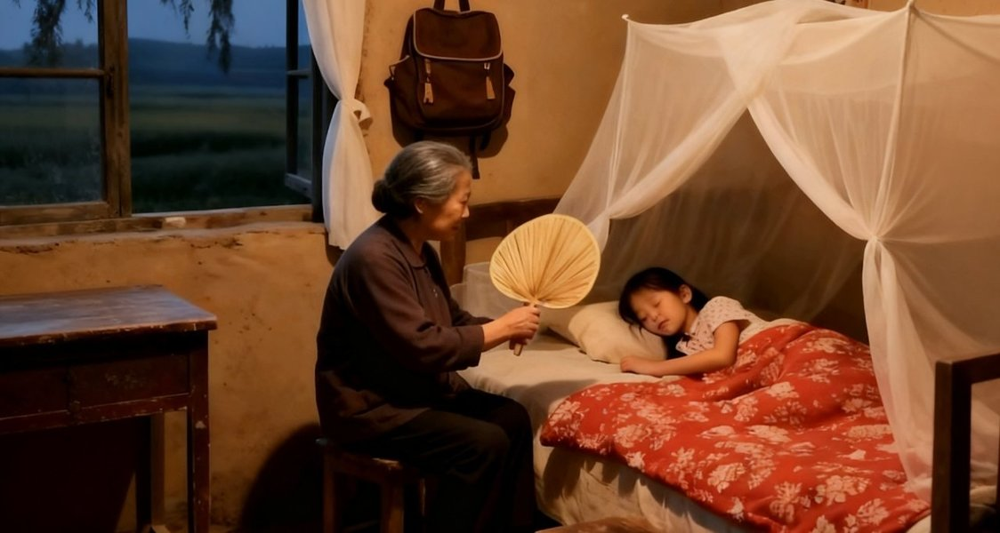

# 把细节给她

三年级时，她把我一个人落在家，自己跑去村东头给别人掰海带，一天只挣50块钱，回家的时候天已经彻底黑了，我饿了也只能吃小卖部买来的干脆面。

六年级时，她冲到我的教室，在课堂上大声嚷嚷着我的同学。

念了初中，读了高中，上了大学，她一次都没有来学校看过我。

她一辈子就守在她的那个农村，在院子里养着她的鸡，养死了多少只，她自己也不知道。

她种着二亩三分地，摔着从地里收上来的花生。

她会为了两毛钱在菜市场和客人争吵半天。

她瞧不上超市里的衣服，也瞧不起饭店的食物。

她记性很差，经常在乡镇的医院里迷路。

她不会骑电瓶车，也不会骑自行车，日复一日年复一年地蹬着她的旧三轮车。

蹬着那辆带着我读完小学三年的三轮车。

她在硬纸盒上写上乘法口诀，骑着三轮车带着我下田。

勾头锥子刺进手指，是她骑着三轮车带着我去医院。

交暑假作业的前一天晚上，为了能让我睡一会，她盯了一宿的时钟。

她看到了我肿起来的眼泡，看到了我枕头上的泪痕，她骑着三轮车去学校问老师要个公道。

她穿我穿过的鞋，走我没走过的路。

缝缝补补的衣服，攒下来一筐又一筐的鸡蛋。

每次放假回家，总有吃不完的鸡蛋，总有一份被卫生纸包住的零钱。

她卖了多少年的粮食，卖了多少自己种的菜，她把她的孙子越送越远。

幼儿园时，她和我在一个村。

小学初中时，她和我在一个镇。

高中时，她和我在一个县。

大学时，她和我在一个省。

她自己就守着她的那个村子，守着她的那群鸡。

她很久没有再去掰海带了，也很久没有买过50一箱的干脆面了。

她常常做在走廊上，看着门口，不知道想些什么。

她可能不知道什么是爱情。

生儿育女，种地卖菜，十年又十年。

夏夜炎热，她给我摇扇驱蚊。

冬寒逼人，她给我添衣加帽。

好东西她从来不给自己留，干脆面她也一包没吃。

她说过最多的话是大人什么没吃过。

确实，她什么都没吃过。

她只是吃着自己种的菜，煮着自己种的米，可是降压药的说明书比我的试卷还长。

买不起金银首饰，她捡来铜块给自己打了一幅手镯。

不会拨打电话，她把老年机带在身上生怕错过一个电话。

但是她会守着她的那群鸡，攒下一筐又一筐鸡蛋…

读了多少的书，看了多少的剧，我想从这些里面学会细节，学会爱。

转身回头时，才发现那些鸡蛋一直都在。
